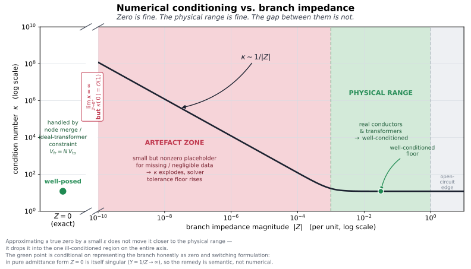

# OPF engine: scope & status

BMOPFTools ships **one reference optimizer**: a nonconvex **four-wire rectangular
current–voltage** optimal power flow engine (see its
[formulation principles](../opf.md#Formulation-principles)), in a package
extension that activates when JuMP and Ipopt are loaded. It is not a general OPF framework, and
it is deliberately the *smaller* half of the project. As the
[positioning page](../positioning.md) puts it, the product is the model and the
tooling around it, not the solver; the [bounds & feasibility](../bounds/index.md)
series is written to be formulation-agnostic precisely because the benchmarks are
meant to be solved by many engines, not just this one.

This page sets the bar for contributions to the engine and the modeling
conventions a new constraint or element should follow.

## The correctness bar

The engine exists to **validate cases and profile solutions**, so its first
obligation is correctness, not features. The mathematical models and methods are
established, not exploratory:

- The formulation is fully derived in `docs/math-model.tex`.
- Feasibility / correctness is checked, not assumed: see
  [`solve_feasibility_opf`](../validation.md) and the relaxed power-flow
  cross-check against OpenDSSDirect in the test suite.
- The [bounds & feasibility](../bounds/index.md) series documents *why* a given
  bound/objective combination is well-posed (or not), and
  [Validating the OPF](../validation.md) is the practical checklist.

The expectation for a new formulation, constraint, or element is therefore:

1. **It is mathematically established** — cite the model (the math-model
   document, the spec, or the literature), don't invent physics in the solver.
2. **It is validated against a known-good reference** — a power-flow comparison
   against OpenDSSDirect, an analytic case, or an existing benchmark with a
   known solution. A constraint that only "looks right" is not enough; the
   feasibility/correctness of the model is the thing being benchmarked.

!!! warning "Not a model zoo"
    It is **not in scope** to accumulate every state-of-the-art formulation here
    so they can be compared through BMOPFTools. That is not what this engine is
    for. The Task Force's role is to navigate towards a *workable, broad spec* —
    a common, faithful representation that can serve as the **basis for your own
    bespoke extensions and formulations**, which you build in your own code or
    framework. If a piece of that work later becomes accepted practice, it can be
    folded back in here (via the spec and the [migration path](versioning.md)).
    Until then, the engine stays small and correct rather than broad.

## Modeling preferences

New constraints should stay consistent with how the engine is built. A few
preferences in particular:

- **Current limits over power limits.** Branch and thermal ratings are already
  current-based (`i_max`). For **device injections**, limits are still mostly
  power-based (`p_max` / `q_max` / `s_max`), with the IBR current limit `i_max`
  an optional add-on — so this is a *preferred direction*, not a description of
  the whole engine. A current bound stays linear or quadratic in the rectangular
  IVR variables and avoids bilinear power expressions, so **new injection
  constraints should prefer a current form where practical**. (This mirrors the
  Tier-3 note in the [style guide](style_guide.md).)
- **Impedance over admittance, for series elements.** Series elements (lines,
  transformer windings) are represented with **impedance** `R + jX`, not
  admittance `G + jB`. The reason is the lossless limit: as `R → 0` the impedance
  form stays finite, whereas an admittance form blows up (`G → ∞`) for a lossless
  branch. Keeping series elements in impedance form **preserves the capability to
  build lossless models**. Shunts and the transformer no-load branch are
  naturally admittances (a lossless shunt is pure `B`, with no blow-up) and stay
  in `G + jB` form — there is no tension there.
- **Put valid bounds on current variables where possible/reasonable.** The
  current variables are first-class in an IVR formulation, and giving them sound
  bounds tightens the feasible region and helps the solver. Where a defensible
  current bound exists (a conductor ampacity, a converter limit), prefer to state
  it on the current variable directly.
- **Bounds are largely optional — do not infer one from another.** Many, if not
  all, of the bounds in the data model are optional, and different formulations
  activate different subsets (see [Optimal power flow](../opf.md)). So you
  **cannot** assume that the presence of, say, a power bound lets you derive a
  current bound: the case may carry one, both, or neither, by design. Stamp a
  constraint only from data that is actually present; never synthesise a missing
  bound from an unrelated one.

### [Zero impedance: represent it as is, don't approximate it](@id zero-impedance)

The impedance-over-admittance choice has a sharp practical corollary for
near-zero branches (jumpers, bus ties, idealised regulators, placeholder
transformer leakage). The temptation is to model "approximately zero" impedance
as a small number `ε`. That is the **worst** option on the whole axis:



- **`Z = 0` exactly** is well-conditioned — the engine handles it *semantically*,
  by merging the nodes / imposing the ideal-transformer constraint
  `V_fr = N·V_to`, rather than inverting a near-singular admittance.
- The **physical range** (real conductors and transformers) is well-conditioned.
- The **gap between them** is the only ill-conditioned region on the axis. A
  small `ε` placeholder lands you exactly there, where the condition number grows
  like `1/|Z|` and the solver's effective tolerance floor rises with it.

So `lim_{Z→0⁺} κ = ∞` while `κ(0) = O(1)`: approximating a true zero by a small
value moves it *away* from the well-conditioned point, not toward the physical
range. In pure admittance form this is unavoidable — `Y = 1/Z → ∞` at `Z = 0` —
which is the same reason series elements are kept in impedance form. **The remedy
is semantic, not numerical:** represent the branch as zero and switch
formulation. BMOPFTools' [`fix_case`](../augmentation.md#fix) does exactly this —
collapsing low-impedance lines to switches (pass 4) and snapping placeholder
transformer leakage to exact zero (pass 9) — and the
[zero-voltage / ill-conditioning traps](../bounds/known_traps.md) page catalogues
what happens when this is gotten wrong.

## Extending the engine without forking it

The "not a model zoo" stance above is only tenable because the engine is
extensible from *outside*: a downstream package can add devices, swap the
objective, couple time steps, or pose an entirely different problem — reusing all
the device physics, per-unit handling, and result extraction — without a new
constraint landing in `ext/BMOPFOpfExt/`. Three seams, in increasing order of
reach (full detail under
[extending the formulation](../opf.md#extending-the-formulation)):

- **`model_hook!(ctx)` / `solution_hook!(ctx, result)`** — add custom variables,
  constraints, or objective terms to a single solve, then read their solved
  values. A hook device stamps its current with `add_terminal_injection!` and may
  register its net injection as `result["custom_injection"]` so the power-balance
  check in [`profile_solution`](../validation.md) stays honest. This is how a
  battery, EV charger, or bespoke limit is added **without touching the JSON
  spec**.
- **The staged API** ([`build_opf_model`](@ref) → [`enforce_kcl!`](@ref) →
  [`extract_result`](@ref), with [`generation_cost`](@ref) for the objective) —
  unfuses build/solve/extract so several snapshots share one JuMP model. This is
  what makes **inter-temporal** coupling (battery state of charge across a
  horizon) expressible, which the single-shot [`solve_opf`](@ref) cannot do; see
  [the staged API](../opf.md#staged-api).
- **A different problem specification entirely.** Because `build_opf_model` adds
  operational limits only where the net *declares* them, a bounds-free net yields
  a pure physics model with free voltages; with `add_objective=false` and a
  `model_hook!` objective this hosts **state estimation**, parameter estimation,
  and other model-fitting problems that are not dispatch optimisation. See
  [Beyond OPF](../opf.md#beyond-opf).

Internally the same seam is the `build!` *recipe* (`build_opf!`, `build_pf!`,
`build_feasibility!`): a fourth problem type is a fourth recipe over the
invariant `_build_and_solve` pipeline. Promoting that recipe entry point to a
public `build_custom_model` is the natural step **if** such a formulation
graduates from a downstream experiment to accepted practice — the same "fold it
back in via the spec" path the model-zoo warning describes. Until then, the
public hooks and staged API let you build it in your own package.

### Authoring a `model_hook!`

A `model_hook!(ctx)` runs **after** the standard build (`_add_device_constraints!`
has already stamped every element in the net and populated the KCL accumulators)
and **before** [`enforce_kcl!`](@ref) turns those accumulators into constraints. Two
conventions trip up first-time hook authors.

**Hooks are additive.** A hook may add current with `add_terminal_injection!`, add
variables and constraints, and set the objective. It **cannot replace** a
constraint already stamped for a network element — by the time the hook runs, that
element's Ohm's-law/KCL contribution is already in the model. There are therefore
two ways to make an element's parameter a decision variable:

- **Native free variable — preferred where it exists.** Some element parameters are
  already exposed as optional free variables when the case declares bounds. A
  transformer **tap** is the worked example: set `tap_min`/`tap_max` on the
  transformer, retrieve the effective from→to ratio with
  `opf_object(ctx, opf_transformer_tap_key(tid))`, and let the engine thread it
  through the per-unit-correct,
  base-referred winding constraints. The hook just *reads* (and, across a staged
  multi-snapshot build, *couples*) the handle — the engine keeps ownership of
  per-unit, limits, and native loss/flow bookkeeping.

- **Use a coefficient provider, or omit-and-re-stamp when no native location
  exists.** Native scalar line `R_series`/`X_series` matrix entries can now be
  supplied by typed coefficient providers without replacing the branch. If the
  quantity has no provider-aware native location (for example a line's length),
  **omit that element from the net** and re-stamp its constraint in the hook with
  your own variable, injecting its current into the KCL accumulators. The caveats
  are the flip side of the above: for that element *you* now own the per-unit
  scaling (`opf_bases(ctx)`), any current/power limit, and native loss/flow bookkeeping —
  none of it is applied for an element the engine never saw.

**Terminal injections are positive _into_ the terminal.** `enforce_kcl!` sets
the sum at each `(bus, terminal)` to zero. So a series element from
bus `f` to bus `g` carrying current `I = cr + j·ci` in the `f → g` direction
**subtracts** at its from-terminal (current leaves `f`) and **adds** at its
to-terminal (current enters `g`):

```julia
# series element f → g on conductor c, current I = cr + j·ci
add_terminal_injection!(ctx, f, c, -cr, -ci)
add_terminal_injection!(ctx, g, c,  cr,  ci)
```

A shunt or user injection `I` into `(bus, phase)`, referenced to the bus neutral,
adds at the phase terminal and subtracts the return at the neutral:

```julia
add_terminal_injection!(ctx, bus, phase,    cr,  ci)
add_terminal_injection!(ctx, bus, neutral, -cr, -ci)
```

The native flow/loss ledger uses the same "into bus" sign, so an element's complex loss is
`S_loss = −Σ V·conj(I_into_bus)`. In per-unit mode (`per_unit=true`, the default)
the accumulator currents are per-unit; a SI current/voltage literal in a hook must
be scaled by the matching `opf_bases(ctx)` base.

## Keep it behind the extension boundary

!!! warning "The OPF engine may be carved out into its own package"
    The reference optimizer may eventually be extracted into a separate package,
    leaving BMOPFTools focused on the data model, conversion, analysis, and
    profiling. To keep that option open:

    - Keep the engine behind the existing extension boundary — it lives in
      `ext/BMOPFOpfExt/`, with `JuMP` and `Ipopt` as weak dependencies (see the
      `[weakdeps]` / `[extensions]` blocks in `Project.toml`).
    - **Do not couple core analysis to the engine.** Parsing, validation,
      analysis, reporting, conversion, and augmentation must all work without
      JuMP/Ipopt loaded. Anything that needs the solver belongs in the extension,
      not in `src/`.

## See also

- [Optimal power flow](../opf.md) — running the engine and the formulation.
- [Parameterized and differentiable extensions](../differentiable_extensions.md) —
  the stable downstream-extension contract, scientific scope, native coverage,
  and known limitations.
- [OPF result dictionary](../results.md) — the result-dict shape (part of the
  public API; see [Versioning](versioning.md)).
- [Validating the OPF](../validation.md) and
  [Bounds & feasibility](../bounds/index.md) — the correctness machinery.
