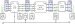

# A worked network example

The [Notation](notation.md) page defines the sets, topology, connectivity, and
terminal-map machinery abstractly. This page makes them concrete by constructing every
set from one small network — the fastest way to internalise how a case is assembled.



The network has four buses $\{\texttt{A},\texttt{B},\texttt{C},\texttt{D}\}$ joined by a
line, a transformer, and a switch, feeding single- and three-phase loads, a single-phase
generator, a neutral-grounding shunt, and a voltage source, with a mix of grounded and
ungrounded terminals. The circled numbers on the figure are element IDs.

## Element sets

The branch and nodal elements (see the [classification](notation.md#Sets-and-indices)
into branch vs nodal):

```math
\begin{aligned}
\mathcal{B} &= \{\texttt{A},\texttt{B},\texttt{C},\texttt{D}\}, &
\mathcal{L} &= \{2\}, &
\mathcal{W} &= \{9\}, &
\mathcal{X} &= \{6\}, \\
\mathcal{D} &= \{1,5,7\}, &
\mathcal{G} &= \{3\}, &
\mathcal{H} &= \{4\}, &
\mathcal{S} &= \{8\}.
\end{aligned}
```

## Topology (branches → buses)

The forward topology orients each branch from its `from` bus to its `to` bus:

```math
\mathcal{T}^{L\rightarrow} = \{2\,\texttt{A}\,\texttt{B}\},\quad
\mathcal{T}^{X\rightarrow} = \{6\,\texttt{C}\,\texttt{B}\},\quad
\mathcal{T}^{W\rightarrow} = \{9\,\texttt{C}\,\texttt{D}\}.
```

The combined line topology adds the reverse orientation,
$\mathcal{T}^{L} = \{2\,\texttt{A}\,\texttt{B},\ 2\,\texttt{B}\,\texttt{A}\}$,
and likewise for the transformer and switch.

## Connectivity (nodal elements → buses)

```math
\mathcal{C}^{D} = \{1\,\texttt{A},\ 5\,\texttt{B},\ 7\,\texttt{D}\},\quad
\mathcal{C}^{G} = \{3\,\texttt{B}\},\quad
\mathcal{C}^{H} = \{4\,\texttt{B}\},\quad
\mathcal{C}^{S} = \{8\,\texttt{C}\}.
```

The single voltage source fixes $|\mathcal{I}^{\text{source}}|=1$ (bus `C` is the reference).

## Terminal maps

Each element lists which bus terminals its conductors connect to, in order. As stored in
the data model (`terminal_map`, or `terminal_map_from`/`_to` for branches):

| Element | Map | Notes |
|---------|-----|-------|
| Load 1 (bus A) | `["a","b","c","n"]` | three-phase wye |
| Load 5 (bus B) | `["c","a"]` | single-phase, across `c`–`a` |
| Load 7 (bus D) | `["a","b","c"]` | delta |
| Generator 3 (bus B) | `["a","n"]` | single-phase |
| Shunt 4 (bus B) | `["n"]` | neutral grounding |
| Source 8 (bus C) | `["a","b","c"]` | |
| Line 2 | from `["a","b","c","n"]`, to `["a","b","c","n"]` | four-wire |
| Transformer 6 | from `["a","b","c","n"]` (C, wye), to `["a","b","c"]` (B, delta) | ΔY |
| Switch 9 | from `["a","b","c"]`, to `["a","b","c"]` | |


## Configurations

The nodal-element connection configurations:

```math
\mathcal{R}^{D} = \{1\!:\!\text{WYE},\ 5\!:\!\text{SINGLE\_PHASE},\ 7\!:\!\text{DELTA}\},\qquad
\mathcal{R}^{G} = \{3\!:\!\text{SINGLE\_PHASE}\}.
```

## Grounding

Buses declare which terminals are perfectly grounded. In this network the source bus
neutral and any explicitly-earthed terminals are pinned to $0\text{ V}$ (bus property),
while the shunt at bus `B` grounds the neutral through an impedance. See
[Grounding](grounding.md) for the full model; the line and shunt additionally carry the
implicit ground connection of their shunt admittances.

From these sets, the [component pages](index.md#Model-summary) instantiate the variables
and constraints: a voltage vector per bus terminal, series currents on the line and
transformer windings, load/generator/source currents, and one KCL equation per terminal
tying them together.
