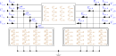

# Lines

A **line** is a multi-conductor power cable or overhead line, modelled as a nominal
$\Pi$ equivalent: a series impedance with a shunt admittance half-section at each
end. Parts 1–5 state the foundational (physics) model; [part
6](#6.-Implementation-in-BMOPFTools) records how BMOPFTools realises it. Symbols are
defined in [Notation](notation.md).



## 1. Data model

A line is an entry of the top-level `line` object, keyed by its string ID $\ell$. It
carries **exactly one impedance source**: either a referenced `linecode` (per-metre
matrices scaled by `length`) *or* inline absolute matrices.

| Field | Type | Unit | Req. | Description |
|-------|------|:----:|:----:|-------------|
| `bus_from`, `bus_to` | string | – | ✔ | Endpoint bus IDs $i$, $j$ |
| `terminal_map_from` | string[] | – | ✔ | Conductor→terminal map at `bus_from`, $\textcolor{purple}{\mathbf{N}_{\ell i}}$ |
| `terminal_map_to` | string[] | – | ✔ | Conductor→terminal map at `bus_to`, $\textcolor{purple}{\mathbf{N}_{\ell j}}$ |
| `linecode` | string | – | (one-of) | Linecode ID (per-metre matrices) |
| `length` | number | m | (with `linecode`) | Line length $\textcolor{red}{L_\ell}$ |
| `R_series_k_j`, `X_series_k_j` | number | Ω | (one-of) | Inline **absolute** series impedance entries |
| `G_from_k_j`, `B_from_k_j` | number | S | | Inline from-side shunt admittance entries |
| `G_to_k_j`, `B_to_k_j` | number | S | | Inline to-side shunt admittance entries |
| `i_max` | number[] | A | | Per-conductor current-magnitude limit (overrides linecode) |
| `s_max` | number[] | VA | | Per-conductor apparent-power limit (overrides linecode) |

The `oneOf` schema rule requires **either** `linecode` + `length` **or** at least
`R_series_1_1` + `X_series_1_1` inline (and then *no* `linecode`).

### Linecode

A `linecode` $c$ stores **per-metre** matrices shared across lines of the same type.

| Field | Type | Unit | Req. | Description |
|-------|------|:----:|:----:|-------------|
| `R_series_k_j`, `X_series_k_j` | number | Ω/m | ✔ | Per-metre series impedance $\mathfrak{R},\mathfrak{I}(\textcolor{brown}{\mathbf{Z}^{\text{s}}_c})$ |
| `G_from_k_j`, `G_to_k_j` | number | S/m | | Per-metre shunt conductance |
| `B_from_k_j`, `B_to_k_j` | number | S/m | | Per-metre shunt susceptance |
| `i_max` | number[] | A | | Per-conductor current limit $\textcolor{red}{\mathbf{I}^{\max}_c}$ |
| `s_max` | number[] | VA | | Per-conductor apparent-power limit |

## 2. Input symbols

| Field | Symbol | Notes |
|-------|:------:|-------|
| linecode `R_series`, `X_series` | $\textcolor{brown}{\mathbf{Z}^{\text{s}}_c}=\mathbf{R}+\textcolor{brown}{j}\mathbf{X}$ | Ω/m matrix |
| linecode `G/B_from`, `G/B_to` | $\textcolor{brown}{\mathbf{Y}^{\text{sh}}_c}=\mathbf{G}+\textcolor{brown}{j}\mathbf{B}$ | S/m matrix |
| `length` | $\textcolor{red}{L_\ell}$ | metres |
| line `R_series`/`X_series`, `G/B_*` | $\textcolor{brown}{\mathbf{Z}^{\text{s}}_\ell},\ \textcolor{brown}{\mathbf{Y}^{\text{sh}}_{\ell ij}},\ \textcolor{brown}{\mathbf{Y}^{\text{sh}}_{\ell ji}}$ | Ω, S (absolute) |
| `i_max` | $\textcolor{red}{\mathbf{I}^{\max}_{\ell ij}}$ | per conductor |
| `s_max` | $\textcolor{red}{\mathbf{S}^{\max}_{\ell ij}}$ | per conductor |

### Parameter construction

The line's series impedance and shunt admittances come from **one** source:

```math
\text{linecode: }\quad
\textcolor{brown}{\mathbf{Z}^{\text{s}}_\ell} = \textcolor{brown}{\mathbf{Z}^{\text{s}}_c}\,\textcolor{red}{L_\ell},
\qquad
\textcolor{brown}{\mathbf{Y}^{\text{sh}}_{\ell ij}} = \textcolor{brown}{\mathbf{Y}^{\text{sh}}_{\ell ji}} = \tfrac{1}{2}\,\textcolor{brown}{\mathbf{Y}^{\text{sh}}_c}\,\textcolor{red}{L_\ell};
```

or the inline absolute matrices are used directly (never scaled by length). Inline
data permits **independent** from- and to-side shunts
$\textcolor{brown}{\mathbf{Y}^{\text{sh}}_{\ell ij}}\neq\textcolor{brown}{\mathbf{Y}^{\text{sh}}_{\ell ji}}$.

## 3. Variables

A line has $n_\ell = |\textcolor{purple}{\mathbf{N}_{\ell i}}|$ conductors. The
**series current** flowing from $i$ toward $j$ is the independent unknown:

```math
\textcolor{blue}{\mathbf{I}^{\text{s}}_{\ell ij}} \in \mathbb{C}^{n_\ell}.
```

The **terminal current** $\textcolor{blue}{\mathbf{I}_{\ell ij}}$ (what enters the
bus's KCL) and the **shunt current** $\textcolor{blue}{\mathbf{I}^{\text{sh}}_{\ell ij}}$
are the other line currents; the equalities of part 4 relate them to
$\textcolor{blue}{\mathbf{I}^{\text{s}}_{\ell ij}}$ and the bus voltages.

## 4. Equality constraints

### Ohm's law (series voltage drop)

Across the series impedance, for the forward orientation $\ell ij$:

```math
\textcolor{blue}{\mathbf{U}_j}[\textcolor{purple}{\mathbf{N}_{\ell j}}]
= \textcolor{blue}{\mathbf{U}_i}[\textcolor{purple}{\mathbf{N}_{\ell i}}]
- \textcolor{brown}{\mathbf{Z}^{\text{s}}_\ell}\,\textcolor{blue}{\mathbf{I}^{\text{s}}_{\ell ij}}.
```

The impedance matrix is full: off-diagonal entries couple the voltage drop on one
conductor to the current in another.

### Shunt currents

Each $\Pi$ half-section draws a current set by its admittance and the local bus
voltage:

```math
\textcolor{blue}{\mathbf{I}^{\text{sh}}_{\ell ij}} = \textcolor{brown}{\mathbf{Y}^{\text{sh}}_{\ell ij}}\,\textcolor{blue}{\mathbf{U}_i},
\qquad
\textcolor{blue}{\mathbf{I}^{\text{sh}}_{\ell ji}} = \textcolor{brown}{\mathbf{Y}^{\text{sh}}_{\ell ji}}\,\textcolor{blue}{\mathbf{U}_j}.
```

### Terminal current and series-current conservation

The current entering the line at each bus is the series current plus that end's shunt
current, and the two directional series currents are equal and opposite:

```math
\textcolor{blue}{\mathbf{I}_{\ell ij}} = \textcolor{blue}{\mathbf{I}^{\text{s}}_{\ell ij}} + \textcolor{blue}{\mathbf{I}^{\text{sh}}_{\ell ij}},
\qquad
\textcolor{blue}{\mathbf{I}_{\ell ji}} = \textcolor{blue}{\mathbf{I}^{\text{s}}_{\ell ji}} + \textcolor{blue}{\mathbf{I}^{\text{sh}}_{\ell ji}},
\qquad
\textcolor{blue}{\mathbf{I}^{\text{s}}_{\ell ij}} + \textcolor{blue}{\mathbf{I}^{\text{s}}_{\ell ji}} = \mathbf{0}.
```

The terminal currents $\textcolor{blue}{\mathbf{I}_{\ell ij}},\textcolor{blue}{\mathbf{I}_{\ell ji}}$
are the contributions this line makes to KCL at buses $i$ and $j$ (see
[Buses §4](bus.md#4.-Equality-constraints)).

## 5. Inequality constraints

### Cartesian variable bounds

A **box** may be placed on the series-current variable
$\textcolor{blue}{\mathbf{I}^{\text{s}}_{\ell ij}}$ to bound the search. Because the
engineering limit constrains the *total* (terminal) current, the box on the series
part is the limit inflated by the worst-case shunt contribution $\rho_k$ on that row:

```math
|\mathfrak{R}(\textcolor{blue}{I^{\text{s}}_{\ell ij,k}})| \le \textcolor{red}{I^{\max}_{\ell ij,k}} + \rho_k,
\qquad
|\mathfrak{I}(\textcolor{blue}{I^{\text{s}}_{\ell ij,k}})| \le \textcolor{red}{I^{\max}_{\ell ij,k}} + \rho_k,
```

with $\rho_k \le \sum_{j'} |\textcolor{brown}{Y^{\text{sh}}_{\ell ij,kj'}}|\,\textcolor{red}{U^{\max}_{i,j'}}$
from the endpoint voltage caps. This is a solver-conditioning aid; it is implied by
the engineering bound below.

### Engineering bounds

**Thermal current limit** on the **terminal current**, at both ends, for all
conductors including neutral:

```math
\textcolor{blue}{\mathbf{I}_{\ell ij}}\circ(\textcolor{blue}{\mathbf{I}_{\ell ij}})^{*} \le \textcolor{red}{\mathbf{I}^{\max}_{\ell ij}}\!\circ\textcolor{red}{\mathbf{I}^{\max}_{\ell ij}},
\qquad
\textcolor{blue}{\mathbf{I}_{\ell ji}}\circ(\textcolor{blue}{\mathbf{I}_{\ell ji}})^{*} \le \textcolor{red}{\mathbf{I}^{\max}_{\ell ij}}\!\circ\textcolor{red}{\mathbf{I}^{\max}_{\ell ij}}.
```

**Apparent-power limit** (optional, from `s_max`), with the terminal power
$\textcolor{blue}{\mathbf{S}_{\ell ij}} = \textcolor{blue}{\mathbf{U}_i}\circ(\textcolor{blue}{\mathbf{I}_{\ell ij}})^{*}$:

```math
\textcolor{blue}{\mathbf{S}_{\ell ij}}\circ(\textcolor{blue}{\mathbf{S}_{\ell ij}})^{*} \le \textcolor{red}{\mathbf{S}^{\max}_{\ell ij}}\!\circ\textcolor{red}{\mathbf{S}^{\max}_{\ell ij}}.
```

**Per-line angle difference** (optional `va_diff_min`/`va_diff_max`). For each
conductor, with $\textcolor{blue}{z}=\textcolor{blue}{U_{i,\cdot}}\,(\textcolor{blue}{U_{j,\cdot}})^{*}=c+\textcolor{brown}{j}s$:

```math
\tan(\textcolor{red}{\theta^{\Delta,\min}_\ell})\, c \ \le\ s \ \le\ \tan(\textcolor{red}{\theta^{\Delta,\max}_\ell})\, c.
```

## 6. Implementation in BMOPFTools

### Realisation

- **Rectangular Ohm's law.** The complex KVL is stamped as its two real parts per
  conductor $k$ ([`branch.jl:_add_line_constraints!`](https://github.com/frederikgeth/BMOPFTools.jl/blob/main/ext/BMOPFOpfExt/branch.jl)):
  $\mathfrak{R}(\textcolor{blue}{U_i})-\mathfrak{R}(\textcolor{blue}{U_j}) = \sum_{j'}(\mathbf{R}_{kj'}\mathfrak{R}(\textcolor{blue}{I^{\text{s}}})-\mathbf{X}_{kj'}\mathfrak{I}(\textcolor{blue}{I^{\text{s}}}))$
  and $\mathfrak{I}(\textcolor{blue}{U_i})-\mathfrak{I}(\textcolor{blue}{U_j}) = \sum_{j'}(\mathbf{R}_{kj'}\mathfrak{I}(\textcolor{blue}{I^{\text{s}}})+\mathbf{X}_{kj'}\mathfrak{R}(\textcolor{blue}{I^{\text{s}}}))$.
- **Shunt currents are not variables.** Where part 4 writes
  $\textcolor{blue}{\mathbf{I}^{\text{sh}}}=\textcolor{brown}{\mathbf{Y}^{\text{sh}}}\textcolor{blue}{\mathbf{U}}$
  as a current, the code introduces **no** variable for it. It builds the affine JuMP
  expression $\textcolor{brown}{\mathbf{Y}^{\text{sh}}}\textcolor{blue}{\mathbf{U}}$
  ([`shunt.jl:_shunt_current!`](https://github.com/frederikgeth/BMOPFTools.jl/blob/main/ext/BMOPFOpfExt/shunt.jl)) and substitutes it **in place**
  wherever $\textcolor{blue}{\mathbf{I}^{\text{sh}}}$ appears — the KCL contribution
  and the terminal-current limit. The terminal current
  $\textcolor{blue}{\mathbf{I}_{\ell ij}}=\textcolor{blue}{\mathbf{I}^{\text{s}}_{\ell ij}}+\textcolor{brown}{\mathbf{Y}^{\text{sh}}_{\ell ij}}\textcolor{blue}{\mathbf{U}_i}$
  is thus an expression, not a variable. This is exact — it eliminates the shunt-current
  variables and their defining equalities analytically.
- **Series-current alias.** Only the from-side series current is a variable
  (`cr_fr`/`ci_fr`, [`variables.jl:_add_line_variables!`](https://github.com/frederikgeth/BMOPFTools.jl/blob/main/ext/BMOPFOpfExt/variables.jl)); the
  conservation law $\textcolor{blue}{\mathbf{I}^{\text{s}}_{\ell ji}}=-\textcolor{blue}{\mathbf{I}^{\text{s}}_{\ell ij}}$
  is applied by making the to-side an `AffExpr` alias `-cr_fr`, so it is never a
  separate variable or equality.
- **Conductor counts** of the impedance matrix and both terminal maps must match
  exactly; a mismatch is refused (`E.INT.LINE_DIM_MISMATCH`), never truncated.
- **Cartesian box** is `_limit_current_box!` in `branch.jl`, added only when every
  voltage cap feeding the row is known. The **thermal/apparent-power** limits are the
  quadratics on the total-current and total-power expressions; the **angle** limit is
  `branch.jl:_add_line_angle_constraints!`.

### Source map

| Constraint | Code location |
|------------|---------------|
| Series current variable | `variables.jl:_add_line_variables!` |
| Impedance / shunt construction | `data_utils.jl:_line_z_matrix`, `_line_pi_shunt` |
| Ohm's law (rectangular) | `branch.jl:_add_line_constraints!` |
| Shunt-current expression (substituted) | `shunt.jl:_shunt_current!` |
| KCL contributions | `branch.jl:_add_line_constraints!` (`_kcl_add!`) |
| Thermal / apparent-power limits | `branch.jl:_add_line_constraints!` |
| Series-current box | `branch.jl` (`_limit_current_box!`) |
| Per-line angle limit | `branch.jl:_add_line_angle_constraints!` |

### Reconciliation notes (data model)

!!! note "Line data model is broader than the PDF"
    The PDF's line object lists only `length`, `linecode`, `bus_from/to`,
    `terminal_map_from/to`. The schema and code also support **inline absolute
    impedance matrices** (`R_series_k_j`, …, an alternative to `linecode`) and
    **per-line `i_max`/`s_max` overrides** of the linecode's ratings. Both ratings
    follow the precedence **line override → linecode → unconstrained** (applied
    independently to `i_max` and `s_max`), and both are enforced natively by the
    OPF — the current cone `I∘I* ≤ I_max∘I_max` and the ground-referenced
    per-conductor apparent-power cone `S∘S* ≤ S_max∘S_max` with
    `S = U∘conj(I)`. The binding one can change with voltage, so the pair is not
    mathematically redundant, but declaring both is usually an engineering
    duplication; current is the source of truth for conductors and the neutral
    entry of `s_max` is degenerate (`U_n ≈ 0`).
    See [current vs. apparent-power limits](../opf.md#Current-vs-apparent-power-limits).

!!! warning "Asymmetric shunt half-sections"
    The PDF assumes symmetric half-shunts
    $\textcolor{brown}{\mathbf{Y}^{\text{sh}}_{\ell ij}}=\textcolor{brown}{\mathbf{Y}^{\text{sh}}_{\ell ji}}$.
    The code supports **independent** `G_from/B_from` vs `G_to/B_to`, so the two ends
    may differ; the symmetric case is the special case of equal fields.
