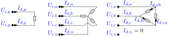

# Loads

A **load** draws a specified power at a bus. Its power may be constant, or vary with
voltage (ZIP / exponential). Three connection configurations are supported:
single-phase, wye (with neutral return), and delta. Parts 1–5 state the foundational
model; [part 6](#6.-Implementation-in-BMOPFTools) records how BMOPFTools realises it.
Symbols are defined in [Notation](notation.md). For *choosing* between the load
models — and identifying one from measurements — see the
[load-model tutorial](../tutorial_load_models.md).



## 1. Data model

A load is an entry of the top-level `load` object, keyed by its string ID $d$.

| Field | Type | Unit | Req. | Description |
|-------|------|:----:|:----:|-------------|
| `bus` | string | – | ✔ | Host bus ID $i$ |
| `terminal_map` | string[] | – | ✔ | Conductor→terminal map $\textcolor{purple}{\mathbf{N}_{d}}$ |
| `configuration` | string | – | ✔ | `WYE`, `SINGLE_PHASE`, or `DELTA` |
| `p_nom`, `q_nom` | number[] | W, var | ✔ | Nominal per-sub-load active/reactive power |
| `model` | string | – | | `constant_power` (default), `constant_current`, `constant_impedance`, `zip`, `exponential` |
| `v_nom` | number[] | V | (zip/exp) | Nominal voltage at which `p_nom`/`q_nom` hold |
| `alpha_z`, `alpha_i`, `alpha_p` | number[] | – | (zip) | Active ZIP fractions ($\alpha_Z+\alpha_I+\alpha_P=1$) |
| `beta_z`, `beta_i`, `beta_p` | number[] | – | (zip) | Reactive ZIP fractions |
| `gamma_p`, `gamma_q` | number[] | – | (exp) | Active/reactive voltage exponents |

## 2. Input symbols

| Field | Symbol | Notes |
|-------|:------:|-------|
| `p_nom`, `q_nom` | $\textcolor{red}{P^{\text{nom}}_{d}},\ \textcolor{red}{Q^{\text{nom}}_{d}}$ | per sub-load |
| `v_nom` | $\textcolor{red}{V^{\text{nom}}_{d}}$ | reference voltage |
| ZIP fractions | $\textcolor{red}{\alpha_Z,\alpha_I,\alpha_P},\ \textcolor{red}{\beta_Z,\beta_I,\beta_P}$ | |
| exponents | $\textcolor{red}{\gamma_P},\ \textcolor{red}{\gamma_Q}$ | |

A **sub-load** $k$ is one two-terminal power element of the load: a phase-to-neutral
branch (`WYE`), the single terminal pair (`SINGLE_PHASE`), or one line-to-line branch
(`DELTA`).

## 3. Variables

Each sub-load $k$ draws a complex current $\textcolor{blue}{I_{d,k}}$, stacked into
$\textcolor{blue}{\mathbf{I}_{d}}$. These are the currents the load contributes to
KCL; the neutral return current is not an independent variable.

## 4. Equality constraints

### Sub-load voltage drop and power

Let $\Delta\textcolor{blue}{U_{d,k}}$ be the voltage across sub-load $k$:
phase-to-neutral for `WYE`, the terminal-pair difference for `SINGLE_PHASE`,
line-to-line for `DELTA`. The complex power the sub-load absorbs is

```math
\textcolor{blue}{S_{d,k}} = \Delta\textcolor{blue}{U_{d,k}}\,(\textcolor{blue}{I_{d,k}})^{*}
= P_{d,k} + \textcolor{brown}{j}\,Q_{d,k}.
```

**Constant power** (default) pins it to the nominal setpoint:

```math
P_{d,k} = \textcolor{red}{P^{\text{nom}}_{d,k}},
\qquad
Q_{d,k} = \textcolor{red}{Q^{\text{nom}}_{d,k}}.
```

**Voltage-dependent (ZIP)** scales the setpoint by impedance/current/power fractions
of the voltage-magnitude ratio $|\Delta\textcolor{blue}{U_{d,k}}|/\textcolor{red}{V^{\text{nom}}_{d,k}}$:

```math
\begin{aligned}
P_{d,k} &= \textcolor{red}{P^{\text{nom}}_{d,k}}\left(\textcolor{red}{\alpha_Z}\,\frac{|\Delta\textcolor{blue}{U_{d,k}}|^2}{(\textcolor{red}{V^{\text{nom}}_{d,k}})^2} + \textcolor{red}{\alpha_I}\,\frac{|\Delta\textcolor{blue}{U_{d,k}}|}{\textcolor{red}{V^{\text{nom}}_{d,k}}} + \textcolor{red}{\alpha_P}\right),\\
Q_{d,k} &= \textcolor{red}{Q^{\text{nom}}_{d,k}}\left(\textcolor{red}{\beta_Z}\,\frac{|\Delta\textcolor{blue}{U_{d,k}}|^2}{(\textcolor{red}{V^{\text{nom}}_{d,k}})^2} + \textcolor{red}{\beta_I}\,\frac{|\Delta\textcolor{blue}{U_{d,k}}|}{\textcolor{red}{V^{\text{nom}}_{d,k}}} + \textcolor{red}{\beta_P}\right).
\end{aligned}
```

**Exponential** uses a power law
$P_{d,k} = \textcolor{red}{P^{\text{nom}}_{d,k}}\,(|\Delta\textcolor{blue}{U_{d,k}}|/\textcolor{red}{V^{\text{nom}}_{d,k}})^{\textcolor{red}{\gamma_P}}$
(and likewise $Q$ with $\textcolor{red}{\gamma_Q}$). Constant-impedance, constant-current
and constant-power are the special cases $\alpha=(1,0,0),(0,1,0),(0,0,1)$ and integer
exponents $\gamma\in\{2,1,0\}$.

### Current conservation

The sub-load currents sum to zero over the load's terminals (the neutral / return
carries $-\sum_k\textcolor{blue}{I_{d,k}}$), giving the KCL contribution at each host
terminal.

## 5. Inequality constraints

**None (foundational).** A load has no rating bounds in this model — it is a fixed or
voltage-dependent power sink. (See part 6 for the auxiliary variable *box bounds* the
implementation adds purely for conditioning.)

## 6. Implementation in BMOPFTools

### Realisation

- **Rectangular bilinear power.** With $\Delta v^r,\Delta v^i$ the drop and
  `crd`/`cid` the sub-load current, the code stamps
  $P = \Delta v^r\,\text{crd} + \Delta v^i\,\text{cid}$ and
  $Q = \Delta v^i\,\text{crd} - \Delta v^r\,\text{cid}$
  ([`load.jl:_add_load_constraints!`](https://github.com/frederikgeth/BMOPFTools.jl/blob/main/ext/BMOPFOpfExt/load.jl)), then pins them per `model`
  (`_add_subload_power!`).
- **Quadratic ZIP/exponential.** A squared-voltage-drop **variable**
  $W=\Delta v^{r2}+\Delta v^{i2}$ (and, when a constant-current term is present,
  $s=\sqrt{W}$) is introduced so ZIP terms stay quadratic. Integer exponents are
  routed to the constant-Z/I/P terms; only a genuinely non-integer exponent emits the
  nonlinear term $\textcolor{red}{P^{\text{nom}}}(W/\textcolor{red}{V^{\text{nom}}}^2)^{\gamma/2}$.
- **`SINGLE_PHASE` two-terminal handling.** A length-2 map is treated as one element
  between the two listed terminals — phase-to-neutral *or* phase-to-phase — not as a
  phase-to-ground load, so 240 V split-phase loads are modelled correctly.
- **KCL** contributions are added at the host terminals (`_kcl_add!`); the neutral
  return is implicit as the sum of phase currents.

### Cartesian bounds (conditioning only)

The auxiliary $W$ (and $s$) carry box bounds at $[0.5\,\textcolor{red}{V^{\text{nom}}},1.5\,\textcolor{red}{V^{\text{nom}}}]^2$
— deliberately wider than any supply standard. These bound the *auxiliary* variables
for solver conditioning; the operational voltage limits live on the bus, not here.

### Source map

| Constraint | Code location |
|------------|---------------|
| Load currents, KCL, per-config voltage drop | `load.jl:_add_load_constraints!` |
| Power pinning (constant / ZIP / exponential) | `load.jl:_add_subload_power!`, `_component_terms`, `_rhs_expr` |

!!! note "Reconciliation note — voltage-dependent models are an extension"
    The Task Force PDF's core load model is constant power; the ZIP/exponential
    models (and `model`, `v_nom`, `alpha_*`, `beta_*`, `gamma_*` fields) appear in its
    errata addendum and are fully implemented here. Fold them into the primary load
    data model when the PDF is superseded.
