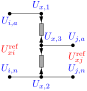

# Regulators

A **step-voltage regulator** is an **autotransformer**: a *series* winding and a *common*
(shunt) winding share a node, so the source (`from`) and regulated (`to`) sides are
**galvanically tied**, not isolated like a two-winding [transformer](transformer.md). It
adjusts the voltage by a tap ratio close to 1. Two objects are provided:
`single_phase_autotransformer` and the monolithic three-phase `open_delta_regulator`.
Parts 1–5 state the foundational model; [part 6](#6.-Implementation-in-BMOPFTools) records
the realisation. Symbols are defined in [Notation](notation.md).



!!! note "Two ways to conceptualise a regulator — series branch vs shunt terminal"
    A regulator admits two modelling views. **(1) As a series branch** — a two-port
    element on the feeder with a *from* (source) and a *to* (regulated) bus, power flowing
    through it exactly like a transformer. This is the natural power-systems reading for
    anyone used to galvanic (isolated) transformers, and it is what this specification
    adopts: the regulator is a branch in the network topology $\mathcal{T}^{X}$ with
    `bus_from`/`bus_to`. **(2) As a shunt element exposing an extra terminal** — because an
    autotransformer is *not* galvanically isolated, the regulated node is electrically part
    of the source bus, so one could keep a single bus, add a tapped terminal, and have the
    regulator inject a shunt current that sets that terminal's voltage.

    We use the **series** view for consistency with the [transformer](transformer.md)
    element and the galvanic-transformer intuition, while still capturing the
    non-isolation exactly: the shared bushing is tied by the galvanic bond (a
    through-branch current, [§4](#4.-Equality-constraints)), so the from and to sides
    remain one electrical node even though they sit on two buses. The shunt view is the
    same physics re-partitioned — it trades the extra bus for an extra terminal — and is
    equally valid; a reader should not mistake the two-bus series form for galvanic
    isolation.

## 1. Data model

Entries under `transformer.single_phase_autotransformer` and
`transformer.open_delta_regulator`, keyed by string ID $x$.

| Field | Type | Unit | Req. | Description |
|-------|------|:----:|:----:|-------------|
| `bus_from`, `bus_to` | string | – | ✔ | Source-side and regulated-side buses |
| `terminal_map_from`, `terminal_map_to` | string[] | – | ✔ | Arity (2,2) single-phase; (4,4) open-delta |
| `tap_ratio` | number / number[] | – | | Regulation ratio (regulated/source), e.g. $[0.9,1.1]$; per-regulator array for open-delta |
| `tap_ratio_min`, `tap_ratio_max` | number | – | | A free OPF variable when `min < max`; otherwise fixed |
| `regulator_type` | enum | – | | ANSI `A` or `B` (see below) |
| `connection` | enum | – | (open-delta) | Phase-pair wiring `ABBC` / `BCAC` / `CABA` |
| `r_series_from`/`_to`, `x_series_from`/`_to` | number | Ω | | Series-winding leakage |
| `g_no_load`, `b_no_load` | number | S | | No-load shunt at the `from` terminals |
| `s_rating` | number | VA | | Rating |
| `i_max_from`, `i_max_to` | number[] | A | | Per-conductor current limits |

## 2. Input symbols

| Field | Symbol | Notes |
|-------|:------:|-------|
| `tap_ratio` | $\textcolor{red}{a}$ | regulated/source ratio |
| `regulator_type` | — | selects $\textcolor{red}{n_{\text{eff}}}$ from $\textcolor{red}{a}$ |
| `r/x_series_*` | $\textcolor{brown}{Z^{\text{fr}}_x},\ \textcolor{brown}{Z^{\text{to}}_x}$ | series leakage |
| `g/b_no_load` | $\textcolor{brown}{Y_0}=\textcolor{red}{G_0}+\textcolor{brown}{j}\textcolor{red}{B_0}$ | no-load shunt |

The **effective from→to ratio** depends on the ANSI connection (which winding is the
series winding):

```math
\textcolor{red}{n_{\text{eff}}} =
\begin{cases}
\textcolor{red}{a} & \text{type B (series on source side, standard SVR)},\\
1/\textcolor{red}{a} & \text{type A (series on regulated side)}.
\end{cases}
```

## 3. Variables

Each regulating winding carries a series current $\textcolor{blue}{I_{x,\text{fr},k}}$
(from side) and $\textcolor{blue}{I_{x,\text{to},k}}$ (to side). Because the sides are
galvanically tied, the shared bushing also carries a **bond current** (a through-branch
current variable) — one per shared node. When the tap is free, $\textcolor{red}{n_{\text{eff}}}$
becomes a decision variable.

## 4. Equality constraints

### Regulating winding

Across one winding spanning terminal pair $(p,q)$ on each side, the voltage and
ampere-turn relations have the **same form** as the isolated single-phase transformer,
with the combined leakage $\textcolor{brown}{Z_x}=\textcolor{brown}{Z^{\text{fr}}_x}+\textcolor{red}{n_{\text{eff}}}^2\textcolor{brown}{Z^{\text{to}}_x}$:

```math
\textcolor{blue}{V^{\text{fr}}_{x,k}} - \textcolor{red}{n_{\text{eff}}}\,\textcolor{blue}{V^{\text{to}}_{x,k}} = \textcolor{brown}{Z_x}\,\textcolor{blue}{I_{x,\text{fr},k}},
\qquad
\textcolor{red}{n_{\text{eff}}}\,\textcolor{blue}{I_{x,\text{fr},k}} + \textcolor{blue}{I_{x,\text{to},k}} = 0,
```

where $\textcolor{blue}{V^{\sigma}_{x,k}}$ is phase-to-neutral (single-phase L-N) or
line-to-line (open-delta, and single-phase L-L). A lossless ideal regulator collapses to
$\textcolor{blue}{V^{\text{to}}}=\textcolor{red}{n_{\text{eff}}}^{-1}\textcolor{blue}{V^{\text{fr}}}$.

The loss elements are two of the three in the transformer
[loss equivalent circuit](transformer.md#The-loss-equivalent-circuit): the **series
leakage** $\textcolor{brown}{Z_x}=\textcolor{brown}{Z^{\text{fr}}_x}+\textcolor{red}{n_{\text{eff}}}^2\textcolor{brown}{Z^{\text{to}}_x}$
(from `r/x_series_from`, `r/x_series_to`) and the **no-load shunt**
$\textcolor{brown}{Y_0}=\textcolor{red}{G_0}+\textcolor{brown}{j}\textcolor{red}{B_0}$
(from `g_no_load`, `b_no_load`). A regulator has **no** isolated secondary, so — unlike a
transformer — the shunt sits on the **from** side; and it exposes no internal winding
neutral, so there is no `r/x_neutral` grounding branch.


The one visible difference from the [transformer circuit](transformer.md#The-loss-equivalent-circuit)
is the **shared neutral rail**: a transformer's two neutrals are isolated, whereas the
regulator's are bonded into a single node — the graphical signature of an autotransformer.

### The galvanic tie (what makes it a regulator)

The departure from the isolated model is at the **shared node**. The series and common
windings share a bushing — the neutral for an L-N regulator, or the common phase for an
open-delta bank — so both sides' return currents close there. When the shared reference
$q$ is a single node, its KCL combines both returns:

```math
\textcolor{blue}{I_{x,q}} + \textcolor{blue}{I_{x,\text{fr},k}} + \textcolor{blue}{I_{x,\text{to},k}} = 0
\ \Longleftrightarrow\
\textcolor{blue}{I_{x,q}} + (1-\textcolor{red}{n_{\text{eff}}})\,\textcolor{blue}{I_{x,\text{fr},k}} = 0.
```

When the reference is exposed as two data terminals (`t_fr_q`, `t_to_q`) on two buses,
they are bonded by a zero-impedance through-branch — equal voltage plus a bond current —
so the primary return closes at `t_fr_q` and the secondary at `t_to_q` while remaining
electrically one node. The four terminal injections sum to zero, keeping the loss
identity exact. The no-load shunt $\textcolor{brown}{Y_0}$ is placed across the from-side
winding voltage.

### Open-delta specifics

An `open_delta_regulator` is **two** line-to-line regulating windings across the phase
pairs implied by `connection` (`ABBC` ⇒ regulators across $(a,b)$ and $(b,c)$; etc.),
each obeying the regulating-winding relation above with its own $\textcolor{red}{n_{\text{eff}}}$.
The phase common to both windings ($b$ in `ABBC`) is a **copper straight-through**: its
from and to voltages are tied, $\textcolor{blue}{U_{i,b}}=\textcolor{blue}{U_{j,b}}$, with
a wire current carrying the balance (the "common neutral" model that matches OpenDSS and
field measurement). The third phase and neutral follow from KCL.

## 5. Inequality constraints

### Cartesian variable bounds

Optional per-conductor boxes on the series-current components from `i_max_from`/`i_max_to`.

### Engineering bounds

Per-winding current-magnitude circles, per side and conductor:

```math
\textcolor{blue}{I_{x,\sigma,k}}\,(\textcolor{blue}{I_{x,\sigma,k}})^{*} \le (\textcolor{red}{I^{\max}_{x,\sigma,k}})^2.
```

## 6. Implementation in BMOPFTools

### Realisation

Both regulator subtypes also have an exact nodal **primitive admittance**
$\textcolor{brown}{\mathbf{Y}_x}$ (`Yprim`) — the autotransformer $2\times2$ core and the
two line-to-line open-delta cores — given in closed form on the
[Transformer primitive admittance](transformer-admittance.md#6.-Regulators) page.

- The shared **regulating-winding** relation is stamped by
  [`transformer.jl:_add_regulating_winding!`](https://github.com/frederikgeth/BMOPFTools.jl/blob/main/ext/BMOPFOpfExt/transformer.jl); it writes the to-side leakage via
  $\textcolor{blue}{I_{x,\text{to}}}$ so a free tap stays degree-2, and reduces to
  $\textcolor{brown}{Z_x}=\textcolor{brown}{Z^{\text{fr}}_x}+\textcolor{red}{n_{\text{eff}}}^2\textcolor{brown}{Z^{\text{to}}_x}$ at nominal.
- **`single_phase_autotransformer`** (`_add_autotransformer!`) — one winding across the
  from/to pair, the no-load shunt on the from side, and the galvanic bond (an extra
  from-side current index) tying the shared reference terminals. Getting the shared-node
  sign wrong yields negative regulator losses, so the tie is enforced explicitly.
- **`open_delta_regulator`** (`_add_open_delta_regulator!`) — two windings per the
  `connection` map, each with its own tap ratio, plus the shared-phase straight-through
  (a further through-branch current) reproducing the common-neutral model.
- **ANSI type** selects $\textcolor{red}{n_{\text{eff}}}=\textcolor{red}{a}$ (B) or
  $1/\textcolor{red}{a}$ (A); the tap ratio can be a fixed number or a free OPF variable
  (`tap_ratio_min`/`max`).

### Source map

| Element | Code location |
|---------|---------------|
| Regulating winding (shared relation) | `transformer.jl:_add_regulating_winding!` |
| single_phase_autotransformer | `transformer.jl:_add_autotransformer!` |
| open_delta_regulator | `transformer.jl:_add_open_delta_regulator!` |

!!! warning "Regulators are not in the Task Force PDF"
    Step-voltage regulators (`single_phase_autotransformer`, `open_delta_regulator`) —
    galvanically-tied autotransformers with tap optimisation — are a BMOPFTools
    extension with no counterpart in the current PDF, and are modelled as a distinct
    element from the isolated [transformers](transformer.md). Add them to the superseding
    spec as their own component.
