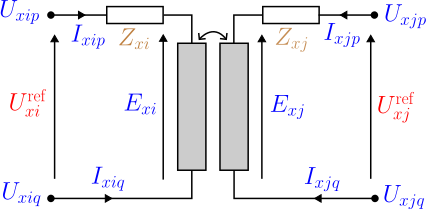

# Transformers

A **transformer** couples two buses through magnetically linked windings, transforming
voltage by a turns ratio and (optionally) modelling copper loss, leakage, and no-load
excitation. Because the winding topologies differ qualitatively, each configuration is
a distinct data-model object: `single_phase`, `center_tap`, `wye_delta`, `delta_wye`.
Parts 1–5 state the foundational model; [part
6](#6.-Implementation-in-BMOPFTools) records how BMOPFTools realises it, including
several subtypes beyond the Task Force PDF. Symbols are defined in
[Notation](notation.md).

## 1. Data model

Each subtype is an entry under `transformer.<subtype>`, keyed by its string ID $t$.
Common fields:

| Field | Type | Unit | Req. | Description |
|-------|------|:----:|:----:|-------------|
| `bus_from`, `bus_to` | string | – | ✔ | Endpoint bus IDs $i$, $j$ |
| `terminal_map_from`, `terminal_map_to` | string[] | – | ✔ | Conductor→terminal maps (lengths per subtype below) |
| `v_ref_from`, `v_ref_to` | number | V | ✔ | Reference (nominal) winding voltages — set the turns ratio |
| `s_rating` | number | VA | ✔ | Nameplate apparent-power rating |
| `r_series_from`, `x_series_from` | number | Ω | | From-winding series impedance |
| `r_series_to`, `x_series_to` | number | Ω | | To-winding series impedance |
| `r_series`, `x_series` | number | Ω | | Single series impedance (Yd/Dy legacy form) |

Terminal-map lengths: `single_phase` 2 + 2; `center_tap` 2 (from) + 3 (to);
`wye_delta` 4 (wye) + 3 (delta); `delta_wye` 3 (delta) + 4 (wye).

## 2. Input symbols

| Field | Symbol | Notes |
|-------|:------:|-------|
| `v_ref_from`, `v_ref_to` | $\textcolor{red}{U^{\text{ref}}_i},\ \textcolor{red}{U^{\text{ref}}_j}$ | turns ratio $\textcolor{red}{N} = \textcolor{red}{U^{\text{ref}}_i}/\textcolor{red}{U^{\text{ref}}_j}$ |
| `r_series_*`, `x_series_*` | $\textcolor{brown}{Z_i}=\textcolor{red}{R_i}+\textcolor{brown}{j}\textcolor{red}{X_i}$, $\textcolor{brown}{Z_j}$ | per-winding leakage |
| `s_rating` | $\textcolor{red}{S^{\max}_t}$ | nameplate |

## 3. Variables

Each winding conductor $k$ on side $\sigma\in\{\text{fr},\text{to}\}$ carries a complex
winding current $\textcolor{blue}{I_{t,\sigma,k}}$. These are the currents the
transformer contributes to KCL at its two buses.

## 4. Equality constraints

### The idealised winding pair


Every transformer is built from **ideal winding pairs** obeying flux linkage, complex
power conservation, and winding KCL. With winding EMFs $\textcolor{blue}{E_i},\textcolor{blue}{E_j}$
and the reference voltages standing in for the turns ratio:

```math
\frac{\textcolor{blue}{E_i}}{\textcolor{red}{U^{\text{ref}}_i}} = \frac{\textcolor{blue}{E_j}}{\textcolor{red}{U^{\text{ref}}_j}},
\qquad
\textcolor{red}{U^{\text{ref}}_i}\,\textcolor{blue}{I_{t,\text{fr}}} + \textcolor{red}{U^{\text{ref}}_j}\,\textcolor{blue}{I_{t,\text{to}}} = 0.
```

Copper loss and leakage enter as a series impedance between the winding EMF and its
terminals (Ohm's law per winding); the ideal EMF replaces the terminal voltage when
all impedances are zero, recovering $\textcolor{blue}{U_i}=\textcolor{red}{N}\,\textcolor{blue}{U_j}$.

**Power/thermal limit** (nameplate), per winding pair:

```math
|\textcolor{blue}{E_i}\,(\textcolor{blue}{I_{t,\text{fr}}})^{*}| \le \frac{\textcolor{red}{S^{\max}_t}}{\textcolor{red}{n_t}},
```

with $\textcolor{red}{n_t}$ the number of winding pairs (1 single-phase, 3 three-phase;
center-tap uses 1 on the from winding and 2 on the to legs).

### Single-phase (wye–wye)



One winding pair per phase; $\textcolor{blue}{U_i}=\textcolor{red}{N}\,\textcolor{blue}{U_j}$
less the series drop, with current coupling $\textcolor{red}{N}\,\textcolor{blue}{I_{t,\text{fr}}}+\textcolor{blue}{I_{t,\text{to}}}=0$.

### Center-tap (split-phase)


One HV winding drives **two** anti-series LV legs sharing a center-tap neutral (two
from terminals, three to terminals). The LV legs carry independent currents under
unbalance; KCL and flux linkage read

```math
\textcolor{blue}{I_{t,\text{fr}}} + \textcolor{blue}{I'_{t,\text{fr}}} = 0,
\quad
\textcolor{blue}{I_{t,\text{to}}} + \textcolor{blue}{I^{n}_{t,\text{to}}} + \textcolor{blue}{I'_{t,\text{to}}} = 0,
\quad
\frac{\textcolor{blue}{E_i}}{\textcolor{red}{U^{\text{ref}}_i}} = \frac{\textcolor{blue}{E^{\text{leg}}_j}}{\textcolor{red}{U^{\text{ref}}_j}},
```

where $\textcolor{red}{U^{\text{ref}}_j}$ is the **per-leg** (e.g. 120 V) reference.
The center-tap neutral terminal is typically perfectly grounded.

### Wye–delta / delta–wye


Three winding pairs. The delta connection introduces a $\sqrt{3}$ factor, so the
effective per-winding ratio is

```math
\textcolor{red}{n^{\text{eff}}} =
\begin{cases}
\sqrt{3}/\textcolor{red}{N} & \text{wye\_delta (wye is from)},\\
\textcolor{red}{N}\sqrt{3} & \text{delta\_wye (delta is from)}.
\end{cases}
```

The delta line-to-line voltage equals $\textcolor{red}{n^{\text{eff}}}$ times the wye
phase-to-neutral voltage (less series drops); the current transform is the transpose
(power-conservative); and the wye star point satisfies
$\textcolor{blue}{I^{n}_{t,\text{wye}}}+\sum_k\textcolor{blue}{I_{t,\text{wye},k}}=0$.

## 5. Inequality constraints

### Cartesian variable bounds

Optional per-conductor current boxes on the winding-current components (from `i_max_from`,
`i_max_to`), analogous to lines and generators.

### Engineering bounds

The nameplate power/thermal limit of part 4. Explicit per-winding current or apparent
-power limits are supported through the same rating machinery when supplied.

## 6. Implementation in BMOPFTools

### Realisation

All transformer constraints are linear in the voltage and current variables and stamped
in rectangular form ([`transformer.jl`](https://github.com/frederikgeth/BMOPFTools.jl/blob/main/ext/BMOPFOpfExt/transformer.jl), dispatched by
`_add_transformer_constraints!`):

- **`single_phase` — Γ-equivalent** (`_add_yy_transformer!`). Leakage is referred to
  the **to** side, $\textcolor{red}{R'}=\textcolor{red}{R_j}+\textcolor{red}{R_i}/\textcolor{red}{N_0}^2$
  (likewise $X'$), which keeps the voltage drop degree-2 in the tap and matches the
  OpenDSS turns-scaled Yprim. The no-load admittance $\textcolor{brown}{Y_0}=\textcolor{red}{G_0}+\textcolor{brown}{j}\textcolor{red}{B_0}$
  (`g_no_load`, `b_no_load`) sits across the **winding-2 (to)** coil, matching OpenDSS.
- **`center_tap` — coupled-coil primitive admittance** (`_add_center_tap_transformer!`).
  Rather than eliminating the internal star node symbolically, the code stamps the
  transformer's primitive admittance (Yprim), reproducing OpenDSS's center-tap Yprim
  to machine precision — the two LV legs then carry correctly independent currents
  under unbalance.
- **`wye_delta`/`delta_wye`** (`_add_yd_transformer!`, `wye_is_from` true/false). Uses
  the $\textcolor{red}{n^{\text{eff}}}=\sqrt{3}/\textcolor{red}{N}$ (Yd) or
  $\textcolor{red}{N}\sqrt{3}$ (Dy) referral; per-winding T losses with the no-load
  shunt on winding 2.
- **Neutral grounding.** `r_neutral_*`/`x_neutral_*` (OpenDSS `rneut`/`xneut`) add an
  internal grounding branch $\textcolor{brown}{y_n}=1/(\textcolor{red}{R_n}+\textcolor{brown}{j}\textcolor{red}{X_n})$
  from a side's shared neutral terminal to earth (verified against OpenDSS Yprim).
- **Continuous tap.** When a tap is made a free variable, the turns ratio
  $\textcolor{red}{N}$ (or $\textcolor{red}{n^{\text{eff}}}$) becomes a decision
  variable; the formulation stays degree-2 via an auxiliary $1/n^{\text{eff}}$ pinned
  by $n^{\text{eff}}\cdot(1/n^{\text{eff}})=1$.

### Source map

| Subtype / feature | Code location |
|-------------------|---------------|
| Dispatch | `transformer.jl:_add_transformer_constraints!` |
| single_phase (Γ) | `_add_yy_transformer!` |
| center_tap (Yprim) | `_add_center_tap_transformer!` |
| wye_delta / delta_wye | `_add_yd_transformer!` |
| autotransformer / open-delta / n-winding | `_add_autotransformer!`, `_add_open_delta_regulator!`, `_add_nwinding_constraints!` |

### Reconciliation notes

!!! warning "Implementation supports subtypes beyond the PDF"
    Beyond the four PDF subtypes, the code models `single_phase_autotransformer`,
    open-delta regulators, and general **n-winding** transformers, plus per-winding
    no-load excitation (`g_no_load`/`b_no_load`), internal neutral grounding
    (`r/x_neutral_*`), and **continuous tap optimisation**. None of these are in the
    PDF's transformer section; document them in the superseding spec.

!!! note "Known approximation — Yd/Dy tap referral"
    For `wye_delta`/`delta_wye` under a non-nominal tap, the delta-arm leakage referral
    is held at nominal (a ~0.3–0.5 % approximation); `single_phase`/`center_tap`
    reproduce the tap-scaled leakage exactly. Exact Yd/Dy tap referral is deferred.
