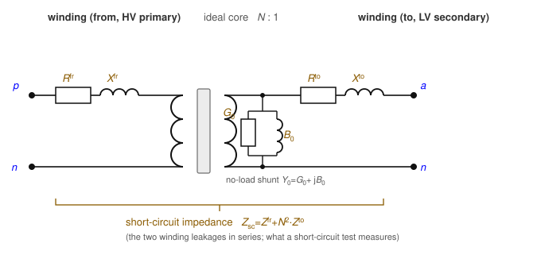
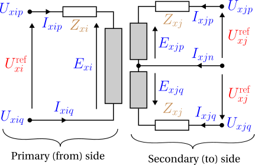
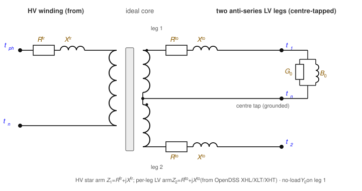
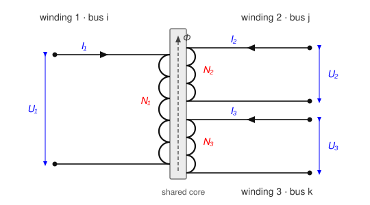

# Transformers

A **transformer** couples two buses through **galvanically isolated** windings —
primary and secondary share no conductor, only magnetic flux. (Step-voltage
**regulators**, where the windings *do* share a node, are a separate element; see
[Regulators](regulator.md).) Because the winding topologies differ qualitatively, each
configuration is a distinct data-model object: `single_phase`, `center_tap`,
`wye_delta`, `delta_wye`, and the general `n_winding`. Every model is built from an
idealised winding pair plus three loss components. Parts 1–5 state the foundational
model; [part 6](#6.-Implementation-in-BMOPFTools) records the realisation. Symbols are
defined in [Notation](notation.md).

!!! note "What a “winding” counts — ports, not physical coils"
    In the literature and in tools, a **winding** (and an *n-winding* transformer)
    usually counts the number of **buses / voltage levels the transformer connects** —
    its *ports* — not the number of physical coils. For a *single-phase* transformer the
    two coincide: a two-winding single-phase unit has two coils and two ports. For a
    *three-phase* transformer they do **not**: a three-phase two-winding transformer has
    **six** physical coils (three per side) yet is still called "two-winding". Throughout
    this specification "winding" means a **port** — one bus connection at one voltage
    level — and each winding comprises `n_phase` physical coils. The `n_winding` object's
    `windings` array lists these ports (each with its own `bus`), so `n` is the number of
    buses, and per phase there are `n` coils on the shared core.

## 1. Data model

Each subtype is an entry under `transformer.<subtype>`, keyed by its string ID $x$.
Common fields (two-winding subtypes):

| Field | Type | Unit | Req. | Description |
|-------|------|:----:|:----:|-------------|
| `bus_from`, `bus_to` | string | – | ✔ | Endpoint bus IDs $i$, $j$ |
| `terminal_map_from`, `terminal_map_to` | string[] | – | ✔ | Conductor→terminal maps (lengths per subtype) |
| `v_nom_from`, `v_nom_to` | number | V | ✔ | Reference winding voltages — set the turns ratio |
| `s_rating` | number | VA | ✔ | Nameplate apparent-power rating |
| `r_series_from`, `x_series_from` | number | Ω | | From-winding series leakage |
| `r_series_to`, `x_series_to` | number | Ω | | To-winding series leakage |
| `g_no_load`, `b_no_load` | number | S | | No-load (core-loss / magnetising) shunt |
| `r_neutral_from`/`_to`, `x_neutral_from`/`_to` | number | Ω | | Winding-neutral grounding impedance (OpenDSS `rneut`/`xneut`) |
| `tap`, `tap_min`, `tap_max` | number | – | | From-side tap multiplier; a free OPF variable when `tap_min < tap_max` |
| `i_max_from`, `i_max_to` | number[] | A | | Per-conductor current limits |

Terminal-map lengths: `single_phase` 2 + 2; `center_tap` 2 (from) + 3 (to);
`wye_delta` 4 (wye) + 3 (delta); `delta_wye` 3 (delta) + 4 (wye). The `n_winding`
object instead carries a `windings` array (each with `bus`, `terminal_map`, `v_nom`,
`configuration`, `r_winding`, optional `delta_roll`, `i_max`) and pairwise
short-circuit reactances `x_sc` keyed `"i_j"`.

## 2. Input symbols

| Field | Symbol | Notes |
|-------|:------:|-------|
| `v_nom_from`, `v_nom_to` | $\textcolor{red}{U^{\text{ref}}_i},\ \textcolor{red}{U^{\text{ref}}_j}$ | turns ratio $\textcolor{red}{N}=\textcolor{red}{U^{\text{ref}}_i}/\textcolor{red}{U^{\text{ref}}_j}$ |
| `r/x_series_from` | $\textcolor{brown}{Z^{\text{fr}}_x}=\textcolor{red}{R^{\text{fr}}_x}+\textcolor{brown}{j}\textcolor{red}{X^{\text{fr}}_x}$ | from-winding leakage |
| `r/x_series_to` | $\textcolor{brown}{Z^{\text{to}}_x}=\textcolor{red}{R^{\text{to}}_x}+\textcolor{brown}{j}\textcolor{red}{X^{\text{to}}_x}$ | to-winding leakage |
| `g/b_no_load` | $\textcolor{brown}{Y_0}=\textcolor{red}{G_0}+\textcolor{brown}{j}\textcolor{red}{B_0}$ | magnetising shunt |
| `r/x_neutral_*` | $\textcolor{brown}{y_n}=1/(\textcolor{red}{R_n}+\textcolor{brown}{j}\textcolor{red}{X_n})$ | neutral grounding |
| `tap` | $\textcolor{red}{\tau}$ (fixed) or $\tau$ (variable) | $\textcolor{red}{N}_{\text{eff}}=\textcolor{red}{N}\,\tau$ |
| `s_rating` | $\textcolor{red}{S^{\max}_x}$ | nameplate |

## 3. Variables

Each winding conductor $k$ on side $\sigma\in\{\text{fr},\text{to}\}$ carries a complex
winding current $\textcolor{blue}{I_{x,\sigma,k}}$. For the winding spanning terminal
pair $(p_k,q_k)$ on bus $b^\sigma$, write the **winding voltage**

```math
\textcolor{blue}{V^{\sigma}_{x,k}} = \textcolor{blue}{U_{b^\sigma,p_k}} - \textcolor{blue}{U_{b^\sigma,q_k}}
```

(phase-to-neutral for a wye winding, line-to-line for a delta winding, with
$\textcolor{blue}{U}=0$ when $q_k$ is absent/ground). When the tap is free, the ratio
$\textcolor{red}{N}_{\text{eff}}$ becomes a decision variable.

## 4. Equality constraints

### The idealised winding pair

Every transformer is built from **ideal winding pairs** obeying flux linkage, complex-
power conservation, and winding KCL. With winding EMFs $\textcolor{blue}{E^{\text{fr}}_x},\textcolor{blue}{E^{\text{to}}_x}$
and the reference voltages standing in for the turns ratio:


```math
\frac{\textcolor{blue}{E^{\text{fr}}_x}}{\textcolor{red}{U^{\text{ref}}_i}} = \frac{\textcolor{blue}{E^{\text{to}}_x}}{\textcolor{red}{U^{\text{ref}}_j}},
\qquad
\textcolor{red}{U^{\text{ref}}_i}\,\textcolor{blue}{I_{x,\text{fr}}} + \textcolor{red}{U^{\text{ref}}_j}\,\textcolor{blue}{I_{x,\text{to}}} = 0
\ \Longleftrightarrow\
\textcolor{red}{N}_{\text{eff}}\,\textcolor{blue}{I_{x,\text{fr}}} + \textcolor{blue}{I_{x,\text{to}}} = 0.
```

The second relation is the **ampere-turn balance**; with all losses removed the EMF is
the terminal voltage and $\textcolor{blue}{V^{\text{fr}}_x} = \textcolor{red}{N}_{\text{eff}}\,\textcolor{blue}{V^{\text{to}}_x}$.

### Loss components

Three loss elements dress the ideal pair. Every subtype places them the **same** way,
consistent with the OpenDSS reference model; the four subtype diagrams below are the same
family of picture, differing only in how the windings connect.

- **Series leakage.** Each winding carries a series impedance between its EMF and its
  terminals (Ohm's law). Referred to the HV (from) side and combined,
  $\textcolor{brown}{Z_x}=\textcolor{brown}{Z^{\text{fr}}_x}+\textcolor{red}{N}_{\text{eff}}^2\,\textcolor{brown}{Z^{\text{to}}_x}$,
  the ideal voltage relation becomes
  $\textcolor{blue}{V^{\text{fr}}_x} - \textcolor{red}{N}_{\text{eff}}\,\textcolor{blue}{V^{\text{to}}_x} = \textcolor{brown}{Z_x}\,\textcolor{blue}{I_{x,\text{fr}}}$.
- **No-load (magnetising) shunt.** A single $\textcolor{brown}{Y_0}=\textcolor{red}{G_0}+\textcolor{brown}{j}\textcolor{red}{B_0}$
  sits across **winding 2** (the to-side coil), referred to that coil's voltage, adding
  a current $\textcolor{brown}{Y_0}\,\textcolor{blue}{V^{\text{to}}_x}$ to the to-side
  terminal — the core-loss/excitation branch (OpenDSS places it on winding 2, verified
  against its `Yprim`).
- **Neutral grounding.** When a wye winding's shared neutral terminal is earthed through
  an impedance, an internal branch $\textcolor{brown}{y_n}=1/(\textcolor{red}{R_n}+\textcolor{brown}{j}\textcolor{red}{X_n})$
  draws $\textcolor{brown}{y_n}\,\textcolor{blue}{U_{b,n}}$ from that neutral terminal to
  earth.

#### The loss equivalent circuit

Read on the standard per-winding-pair equivalent circuit — shown here for the archetypal
two-winding (single-phase) transformer, the reference picture every subtype below
specialises:



- **Winding series impedance** — each coil carries a series leakage,
  $\textcolor{brown}{Z^{\text{fr}}_x}=\textcolor{red}{R^{\text{fr}}_x}+\textcolor{brown}{j}\textcolor{red}{X^{\text{fr}}_x}$
  (from) and $\textcolor{brown}{Z^{\text{to}}_x}$ (to). This is the copper/leakage loss.
- **Short-circuit impedance** — a short-circuit test shorts one side and energises the
  other, so it measures the *series sum* of the two leakages referred to one side,
  $\textcolor{brown}{Z_{\text{sc}}}=\textcolor{brown}{Z^{\text{fr}}_x}+\textcolor{red}{N}_{\text{eff}}^{2}\textcolor{brown}{Z^{\text{to}}_x}$.
  It is **not** a separate element, and the split between the two windings is a
  *modelling choice*, since the test fixes only the sum (see the note below).
- **No-load loss and magnetisation** — the shunt $\textcolor{brown}{Y_0}=\textcolor{red}{G_0}+\textcolor{brown}{j}\textcolor{red}{B_0}$
  on the winding-2 coil carries the **core (no-load) loss** $\textcolor{red}{G_0}$ and the
  **magnetising** susceptance $\textcolor{red}{B_0}$, as an open-circuit test measures.

The **optional neutral-grounding branch** $\textcolor{brown}{y_n}=1/(\textcolor{red}{R_n}+\textcolor{brown}{j}\textcolor{red}{X_n})$
(shown on the from-side neutral) is the third loss element: an internal branch from a wye
winding's neutral terminal to earth. These map one-to-one onto the data fields:
`r/x_series_from` → $\textcolor{brown}{Z^{\text{fr}}_x}$,
`r/x_series_to` → $\textcolor{brown}{Z^{\text{to}}_x}$, `g_no_load` → $\textcolor{red}{G_0}$,
`b_no_load` → $\textcolor{red}{B_0}$, `r/x_neutral_from`/`_to` → $\textcolor{brown}{y_n}$.
The subtype diagrams below omit the $\textcolor{brown}{y_n}$ branch to keep the connection
clear; it attaches to whichever winding carries a groundable neutral (`single_phase`,
`center_tap`, `wye_delta`/`delta_wye`).

!!! note "The per-winding leakage split is under-determined by a short-circuit test"
    A standard short-circuit test yields only $\textcolor{brown}{Z_{\text{sc}}}$ — the
    *sum* of the two winding leakages. Splitting it into $\textcolor{brown}{Z^{\text{fr}}_x}$
    and $\textcolor{brown}{Z^{\text{to}}_x}$ requires an extra convention (OpenDSS splits
    per its winding definitions; a common default is to put it all on one winding, i.e.
    the Γ-model with the other winding's leakage zero). The data model exposes both
    fields so the convention is explicit rather than assumed.

The subtypes below re-arrange exactly these three elements: **single-phase** is the
picture above; **centre-tap** replaces the single secondary arm with two LV-leg arms;
**wye–delta / delta–wye** wrap the pair in a Δ/Y connection with a $\sqrt{3}$ referral;
and **n-winding** generalises the two leakage arms to a star.

### Single-phase (wye–wye)

One winding pair per phase — the archetypal two-winding transformer, whose loss
equivalent circuit is the canonical one in [The loss equivalent circuit](#The-loss-equivalent-circuit)
above. With the combined leakage
$\textcolor{brown}{Z_x}=\textcolor{brown}{Z^{\text{fr}}_x}+\textcolor{red}{N}_{\text{eff}}^2\textcolor{brown}{Z^{\text{to}}_x}$:

```math
\textcolor{blue}{V^{\text{fr}}_{x,k}} - \textcolor{red}{N}_{\text{eff}}\,\textcolor{blue}{V^{\text{to}}_{x,k}} = \textcolor{brown}{Z_x}\,\textcolor{blue}{I_{x,\text{fr},k}},
\qquad
\textcolor{red}{N}_{\text{eff}}\,\textcolor{blue}{I_{x,\text{fr},k}} + \textcolor{blue}{I_{x,\text{to},k}} = 0.
```

The to-side terminal current is $\textcolor{blue}{I_{x,\text{to},k}}+\textcolor{brown}{Y_0}\textcolor{blue}{V^{\text{to}}_{x,k}}$
(series + magnetising); the neutral grounding branch, if present, adds its current at
the shared neutral.

### Center-tap (split-phase)

One HV winding drives **two anti-series LV legs** sharing a centre-tap neutral: two from
terminals $[t^{\text{ph}},t^{\text{n}}]$, three to terminals $[t_1,t^{\text{n}},t_2]$.
The two half-windings are tightly coupled, so the model is a genuine three-winding
(coupled-coil) unit, not two independent legs.



Writing $\textcolor{blue}{V^{\text{hv}}}=\textcolor{blue}{U_{i,t^{\text{ph}}}}-\textcolor{blue}{U_{i,t^{\text{n}}}}$,
$\textcolor{blue}{v_1}=\textcolor{blue}{U_{j,t_1}}-\textcolor{blue}{U_{j,t^{\text{n}}}}$,
$\textcolor{blue}{v_2}=\textcolor{blue}{U_{j,t^{\text{n}}}}-\textcolor{blue}{U_{j,t_2}}$ (winding 3
dotted at the centre tap), HV series current $\textcolor{blue}{I_s}$ and leg currents
$\textcolor{blue}{I_{\ell 1}},\textcolor{blue}{I_{\ell 2}}$:

```math
\begin{aligned}
\textcolor{blue}{V^{\text{hv}}} - \textcolor{red}{N}_{\text{eff}}\,\textcolor{blue}{v_1} &= \textcolor{brown}{Z^{\text{fr}}_x}\,\textcolor{blue}{I_s} - \textcolor{red}{N}_{\text{eff}}\,\textcolor{brown}{Z^{\text{to}}_x}\,\textcolor{blue}{I_{\ell 1}},\\
\textcolor{blue}{V^{\text{hv}}} - \textcolor{red}{N}_{\text{eff}}\,\textcolor{blue}{v_2} &= \textcolor{brown}{Z^{\text{fr}}_x}\,\textcolor{blue}{I_s} + \textcolor{red}{N}_{\text{eff}}\,\textcolor{brown}{Z^{\text{to}}_x}\,\textcolor{blue}{I_{\ell 2}},
\end{aligned}
```

with the ampere-turn coupling and centre-tap KCL

```math
\textcolor{red}{N}_{\text{eff}}\,\textcolor{blue}{I_s} + \textcolor{blue}{I_{\ell 1}} - \textcolor{blue}{I_{\ell 2}} = 0,
\qquad
\textcolor{blue}{I_n} + \textcolor{blue}{I_{\ell 1}} + \textcolor{blue}{I_{\ell 2}} = 0,
```

where $\textcolor{blue}{I_n}$ is the centre-tap current (the leg imbalance). The HV series
current returns through the HV neutral, $\textcolor{blue}{I_{x,\text{fr},n}}=-\textcolor{blue}{I_s}$.
The magnetising shunt $\textcolor{brown}{Y_0}$ sits across winding 2 (LV leg 1,
$\textcolor{blue}{v_1}$). The $\mp\textcolor{red}{N}_{\text{eff}}\textcolor{brown}{Z^{\text{to}}_x}$
sign difference between the legs is the reversed dotting of winding 3; using $+$ for both
makes the legs identical and loses the load-imbalance physics.

The same three loss elements ([The loss equivalent circuit](#The-loss-equivalent-circuit)),
but as a genuine three-winding unit its leakage is a **star** of arms — an HV arm and one
per LV leg, not a single series pair — with the no-load shunt on leg 1:



### Wye–delta and delta–wye

Three winding pairs. The delta connection introduces a $\sqrt{3}$ factor, so the
effective per-winding ratio is


```math
\textcolor{red}{n^{\text{eff}}} =
\begin{cases}
\sqrt{3}/\textcolor{red}{N}_{\text{eff}} & \text{wye\_delta (wye is from)},\\
\textcolor{red}{N}_{\text{eff}}\,\sqrt{3} & \text{delta\_wye (delta is from)}.
\end{cases}
```

For phase $k$ with cyclic partner $k'$ (next for Yd, previous for Dy), the delta
line-to-line voltage equals $\textcolor{red}{n^{\text{eff}}}$ times the wye
phase-to-neutral voltage, less the series drop on the wye phase current
$\textcolor{blue}{I_{x,\text{wye},k}}$ through the effective impedance
$\textcolor{brown}{Z_{\text{eff}}}=\textcolor{red}{n^{\text{eff}}}\textcolor{brown}{Z_{\text{wye}}}+n_\phi\,\textcolor{brown}{Z_{\text{del}}}$:

```math
\textcolor{blue}{U_{\text{del},k}} - \textcolor{blue}{U_{\text{del},k'}}
= \textcolor{red}{n^{\text{eff}}}\big(\textcolor{blue}{U_{\text{wye},k}} - \textcolor{blue}{U_{\text{wye},n}}\big)
- \textcolor{brown}{Z_{\text{eff}}}\,\textcolor{blue}{I_{x,\text{wye},k}}.
```

The current transform is the transpose (power-conservative),
$\textcolor{red}{n^{\text{eff}}}\,\textcolor{blue}{I_{x,\text{del},k}} = -(\textcolor{blue}{I_{x,\text{wye},k}}-\textcolor{blue}{I_{x,\text{wye},k'}})$,
and the wye star point satisfies
$\textcolor{blue}{I_{x,\text{wye},n}}+\sum_k\textcolor{blue}{I_{x,\text{wye},k}}=0$. The
magnetising shunt sits across the winding-2 coils (a delta of branches when the delta is
winding 2, phase-to-neutral when the wye is winding 2); the wye neutral may be grounded
through $\textcolor{brown}{y_n}$.

The same three loss elements ([The loss equivalent circuit](#The-loss-equivalent-circuit))
here wrap a delta primary and a wye secondary, with the $\sqrt{3}$ folded into the
effective ratio $\textcolor{red}{n^{\text{eff}}}$:


### General n-winding

The `n_winding` object models an arbitrary number of windings (each wye or delta) on a
shared core, from the OpenDSS-style short-circuit reactance matrix
$\textcolor{brown}{\mathbf{Z}_B}$ referred to **winding 1**. With per-winding turns
ratio $\textcolor{red}{N_k}=\textcolor{red}{U^{\text{ref}}_k}/\textcolor{red}{U^{\text{ref}}_1}$
($\textcolor{red}{N_1}=1$), referred coil currents
$\textcolor{blue}{I^{\text{r}}_k}=\textcolor{red}{N_k}\textcolor{blue}{I_k}$ and referred
coil voltages $\textcolor{blue}{V^{\text{r}}_k}=\textcolor{blue}{U_k}/\textcolor{red}{N_k}$,
per phase/leg:



```math
\sum_{k=1}^{n}\textcolor{red}{N_k}\,\textcolor{blue}{I_k} = 0,
\qquad
\textcolor{blue}{V^{\text{r}}_1} - \textcolor{blue}{V^{\text{r}}_{i+1}} = \sum_{j=1}^{n-1}\textcolor{brown}{Z_{B,ij}}\,\textcolor{blue}{I^{\text{r}}_{j+1}},\quad i=1,\ldots,n-1.
```

The coil voltage $\textcolor{blue}{U_k}$ is phase-to-neutral for a wye winding and
line-to-line for a delta winding (whose `v_nom` is the line-to-line coil voltage, so the
$\sqrt{3}$ lives in $\textcolor{red}{N_k}$). Each wye coil returns its phase currents
through its neutral; each delta coil injects between its two phase nodes. The magnetising
shunt again sits across winding 2's coil. Tap optimisation is **not** supported for
`n_winding` (the ratios are fixed).

This is the general form of the loss model: the leakage is a **star of per-winding arms**
(referred to winding 1) meeting at a common core node, with the no-load shunt at that
node. It generalises the [two-winding picture](#The-loss-equivalent-circuit) — where the
two arms in series *are* the single short-circuit impedance — to $n$ windings, where each
unordered pair $(i,j)$ has
its own short-circuit reactance $\textcolor{brown}{x_{\text{sc}}}[i,j]$ (the field `x_sc`
keyed `"i_j"`), and the star arms are recovered from that matrix
($\textcolor{brown}{x_{\text{sc}}}[i,j]=\textcolor{red}{X_i}+\textcolor{red}{X_j}$ for a
symmetric star):

![n-winding star (leakage) equivalent, referred to winding 1: each winding contributes a leakage arm to a common core node, the no-load shunt sits at the core, and each winding pair (i,j) has its own short-circuit reactance x_sc[i,j] = X_i + X_j.](assets/nwinding_loss.svg)

So for more than two windings there is **no single "short-circuit reactance"** — only a
matrix of pairwise short-circuits, which is exactly what the `x_sc` field records.

## 5. Inequality constraints

### Cartesian variable bounds

Optional per-conductor current boxes on the winding-current components, from `i_max_from`
/ `i_max_to` (`i_max` per winding for `n_winding`) — implied by the current circles below.

### Engineering bounds

**Per-winding current-magnitude circles**, per conductor $k$ and side $\sigma$:

```math
\textcolor{blue}{I_{x,\sigma,k}}\,(\textcolor{blue}{I_{x,\sigma,k}})^{*} \le (\textcolor{red}{I^{\max}_{x,\sigma,k}})^2.
```

**Nameplate power.** The winding-pair power transfer is bounded by the rating,
$|\textcolor{blue}{E^{\text{fr}}_x}\,(\textcolor{blue}{I_{x,\text{fr}}})^{*}| \le \textcolor{red}{S^{\max}_x}/\textcolor{red}{n_x}$
with $\textcolor{red}{n_x}$ the number of winding pairs (1 single-phase, 3 three-phase;
centre-tap uses 1 on the from winding and 2 on the to legs).

## 6. Implementation in BMOPFTools

### Realisation

Each subtype's device behaviour also has an exact nodal **primitive admittance**
$\textcolor{brown}{\mathbf{Y}_x}$ (`Yprim`); the closed-form matrices — the natural
artifact for cross-checking against OpenDSS or another implementation — are collected on
the [Transformer primitive admittance](transformer-admittance.md) page, and the OPF
stamps the same relations.

All transformer constraints are linear/bilinear in the voltage and current variables,
stamped in rectangular form ([`transformer.jl`](https://github.com/frederikgeth/BMOPFTools.jl/blob/main/ext/BMOPFOpfExt/transformer.jl), dispatched by
`_add_transformer_constraints!`; `nwinding.jl` for `n_winding`):

- **`single_phase`** (`_add_yy_transformer!`) — Γ-model. To keep the tap degree-2, the
  leakage is referred to the **to** side, $\textcolor{brown}{Z'}=\textcolor{brown}{Z^{\text{to}}_x}+\textcolor{brown}{Z^{\text{fr}}_x}/\textcolor{red}{N}_0^2$,
  and the drop written via $\textcolor{blue}{I_{x,\text{to}}}$ using the ampere-turn
  coupling — algebraically identical to the HV-referred $\textcolor{brown}{Z_x}$ above at
  nominal tap, matching the OpenDSS turns-scaled `Yprim`.
- **`center_tap`** (`_add_center_tap_transformer!`) — for a fixed ratio, the exact 5×5
  coupled-coil **primitive admittance** (`Yprim`) is stamped, reproducing OpenDSS to
  machine precision; for a free tap (or a zero star arm) the degree-2 **T-model** above
  is used, which is algebraically identical at nominal.
- **`wye_delta`/`delta_wye`** (`_add_yd_transformer!`) — the $\textcolor{red}{n^{\text{eff}}}$
  referral with the exact tap² short-circuit scaling; the effective-impedance
  coefficients are kept degree-1 in $\{\textcolor{red}{n^{\text{eff}}},1/\textcolor{red}{n^{\text{eff}}}\}$.
- **`n_winding`** (`_add_nwinding_constraints!`) — independent builder using the
  $\textcolor{brown}{\mathbf{Z}_B}$ leakage and ampere-turn relations, connection-aware
  coil incidence.
- **Neutral grounding** (`r/x_neutral_*`) and the **no-load shunt** (`g/b_no_load`) are
  stamped as extra KCL currents at the relevant terminals in every builder.
- **Continuous tap** promotes $\textcolor{red}{N}_{\text{eff}}$ (or $\textcolor{red}{n^{\text{eff}}}$)
  to a variable; an auxiliary $1/\textcolor{red}{n^{\text{eff}}}$ pinned by
  $\textcolor{red}{n^{\text{eff}}}\cdot(1/\textcolor{red}{n^{\text{eff}}})=1$ keeps the
  delta referral degree-2.

### Source map

| Subtype | Code location |
|---------|---------------|
| Dispatch | `transformer.jl:_add_transformer_constraints!` |
| single_phase (Γ) | `_add_yy_transformer!` |
| center_tap (Yprim / T-model) | `_add_center_tap_transformer!` |
| wye_delta / delta_wye | `_add_yd_transformer!` |
| n_winding (ZB leakage) | `nwinding.jl:_add_nwinding_constraints!` |

### Reconciliation notes

!!! note "Known approximation — Yd/Dy tap referral"
    Under a non-nominal tap the delta-arm leakage referral is held at nominal (a
    ~0.3–0.5 % approximation); `single_phase`/`center_tap` reproduce the tap-scaled
    leakage exactly. Exact Yd/Dy tap referral is deferred.

!!! warning "n-winding and loss detail beyond the PDF"
    The general `n_winding` transformer, the per-winding no-load magnetising shunt
    (`g/b_no_load`), and internal neutral grounding (`r/x_neutral_*`) extend the Task
    Force PDF's transformer section; document them in the superseding spec.

!!! note "Center-tap neutral grounding — supported, pending data-model cleanup"
    `single_phase` and `center_tap` share the `single_phase_or_center_tap_transformer`
    schema, which exposes `r/x_neutral_from`/`_to`. **Both builders honour them**: an
    internal $\textcolor{brown}{y_n}=1/(\textcolor{red}{R_n}+\textcolor{brown}{j}\textcolor{red}{X_n})$
    grounding branch — `*_from` grounds the HV neutral, `*_to` grounds the centre-tap
    neutral. This is accepted for OpenDSS compatibility; a future **data-cleanup** pass
    should reify such grounding as an explicit external [`shunt`](shunt.md) object (exactly
    equivalent — verified by an OPF equivalence test) so the transformer zoo stays simpler.
